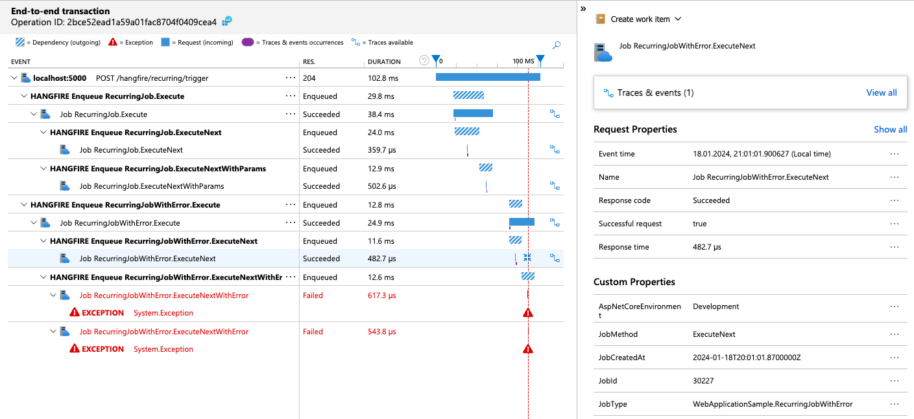

# DeezNuts.Hangfire.ApplicationInsights

Provides Dependency and Request telemetry for Hangfire jobs.

## Installation

Install the `DeezNuts.Hangfire.ApplicationInsights` NuGet package.

### Package Manager Console

```powershell
Install-Package DeezNuts.Hangfire.ApplicationInsights
```

### .NET Core CLI

```shell
dotnet add package DeezNuts.Hangfire.ApplicationInsights
```

## Usage

This package assumes you have `Hangfire` and `Microsoft.ApplicationInsights` installed and configured.
You then need to use following methods when configuring services: `AddHangfireApplicationInsights` and `UseApplicationInsights`:

```cs
builder.Services.AddHangfire((serviceProvider, globalConfiguration) => globalConfiguration
    ...
    .UseApplicationInsights(serviceProvider));

builder.Services.AddHangfireServer();
builder.Services.AddHangfireApplicationInsights();
```

See [Sample Project](./samples/WebApplicationSample) for full configuration example.

## Screenshots





